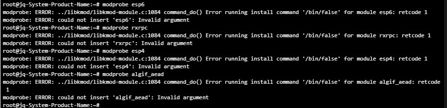

# Linux Privilege Escalation CVE Collection

Linux 内核本地提权及相关高危漏洞的资料集合，包含漏洞分析报告、风险预警文档和自动化检测脚本。

## 涵盖漏洞

| 漏洞            | CVE 编号       | 类型         | 风险等级        | 状态   |
| --------------- | -------------- | ------------ | --------------- | ------ |
| Copy Fail       | CVE-2026-31431 | 本地权限提升 | 高危            | 已复现 |
| Dirty Frag      | 未分配         | 本地权限提升 | 高危            | 已复现 |
| cPanel 认证绕过 | CVE-2026-41940 | 认证绕过     | 严重 (CVSS 9.8) | 已复现 |

## 目录结构

```
.
└── 2026-5-28/
    ├── 漏洞汇总.md                                    # 漏洞详情与修复建议汇总
    ├── detect_vulns.sh                                # 漏洞检测脚本
    ├── mitigate_vulns.sh                              # 漏洞缓解与回滚脚本
    ├── 【已复现】Linux Kernel Dirty Frag 本地权限提升漏洞.pdf
    ├── 【已复现】cPanel 登录流程认证绕过漏洞（CVE-2026-41940）.pdf
    ├── Linux内核CVE-2026-31431Copy_Fail本地提权漏洞风险预警.docx
    └── 关于Linux 内核 Copy Fail 存在本地提权漏洞的预警通报.pdf
```

## 快速开始

### 检测漏洞

```bash
chmod +x 2026-5-28/detect_vulns.sh
sh 2026-5-28/detect_vulns.sh
```

脚本会在当前目录生成日志文件 `漏洞扫描_<IP>_<时间戳>.log`，包含以下检查项：

- **Copy Fail (CVE-2026-31431)**：内核版本判断、`algif_aead` 模块加载状态、`AF_ALG` 使用情况
- **Dirty Frag**：`esp4`/`esp6`/`rxrpc` 模块状态、IPsec 使用情况、缓解配置检查
- **cPanel 认证绕过 (CVE-2026-41940)**：cPanel 安装检测、版本比对、管理端口暴露检查

### 缓解漏洞

```bash
chmod +x 2026-5-28/mitigate_vulns.sh
sudo sh 2026-5-28/mitigate_vulns.sh mitigate-all
```

支持的操作：



| 命令             | 说明                           |
| ---------------- | ------------------------------ |
| `mitigate-all` | 缓解所有漏洞并自动验证封锁结果 |
| `verify`       | 仅验证缓解措施是否生效         |
| `rollback`     | 回滚所有缓解                   |

### 手动排查

#### Copy Fail

```bash
uname -r
lsmod | grep -w algif_aead
lsof | grep AF_ALG
```

#### Dirty Frag

```bash
uname -r
lsmod | egrep '^(esp4|esp6|rxrpc)\b'
```

#### cPanel 认证绕过

```bash
cat /usr/local/cpanel/version
ss -lntp | egrep ':(2082|2083|2086|2087)\b'
```

## 临时缓解措施

可通过缓解脚本一键执行（`sudo sh mitigate_vulns.sh mitigate-all`），或手动操作：

### Copy Fail

```bash
echo "install algif_aead /bin/false" > /etc/modprobe.d/disable-algif-aead.conf
rmmod algif_aead 2>/dev/null || true
sync && echo 3 > /proc/sys/vm/drop_caches
```

### Dirty Frag

```bash
cat > /etc/modprobe.d/dirtyfrag.conf <<'EOF'
install esp4 /bin/false
install esp6 /bin/false
install rxrpc /bin/false
EOF
rmmod esp4 esp6 rxrpc 2>/dev/null || true
```

> **注意**：禁用 `esp4`/`esp6` 会影响 IPsec 功能，请评估业务影响后再操作。

## 修复建议

- **Copy Fail**：升级内核到 `>= 7.0`、`>= 6.19.12` 或 `>= 6.18.22`
- **Dirty Frag**：关注发行版补丁公告，参考主线修复提交 `f4c50a4034e62ab75f1d5cdd191dd5f9c77fdff4`
- **cPanel 认证绕过**：升级到对应分支安全版本，限制管理端口访问来源

## 免责声明

本项目仅用于安全研究和授权测试目的。使用者应遵守当地法律法规，未经授权不得对他人系统进行测试。因使用本项目内容造成的任何后果，作者不承担任何责任。
